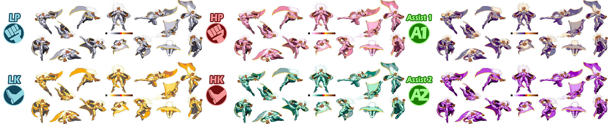

# PLDAT2PNG

 Used for converting MvC2 PLDAT to PNG files.

## Example Using 'SingleCharacter'

 Line 54 has

 ```Py
    mode = 'SingleCharacter'  # SingleCharacter, AllAvailable
 ```  

  Line 57 has

```Py
    chrID = '0x2A'
```  

  I used 3 mixes to test combined previews with button combo label image.

## 6 Palette

  

## 12 Palette

  

## 16 Palette

  
